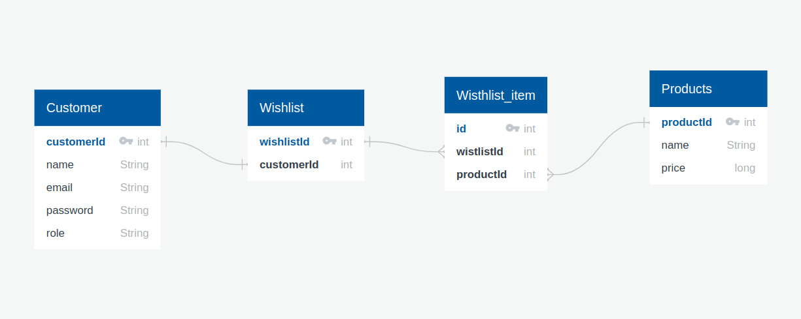

# Xindus-Assignment

# E-Commerce

## Introduction

The purpose of this repository is to use Java, Spring Boot, MySQL, Spring Security to create a basic e-commerce backend app.

## Project Type

Backend

## Deplolyed App

Backend:(https://guiltless-pigs-production.up.railway.app/api/products)

<!-- Database: https:// -->

## ER-Diagram



## Video Walkthrough of the project

## Video Walkthrough of the codebase

## Features

##### User

- Register a new customer and log in to get JWT Token
- Add item to wishlist and remove item from wishlist
- Retrieve items from wishlist

##### Admin

- Admin register, Log In to get JWT Token
- Add product in database

## Design decisions or assumptions

- Considered a small level application
- Products doesn't have category for now
- Creating orders not considered
- For checking purpose register admin endpoint created

## Installation & Getting started

- Download or clone the repositor using `git clone https://github.com/MahangareRohan1203/Xindus-Assignment.git`
- Create Database ecommerce_xindus using `CREATE DATABASE ecommerce_xindus`
- Set username, password, url in application.properties file.

```java
spring.datasource.url=jdbc:mysql://127.0.0.1:3306/ecommerce_xindus
spring.datasource.username=yourUsernameMYSQL
spring.datasource.password=yourPassword
spring.datasource.driver-class-name=com.mysql.cj.jdbc.Driver
```

- Open ecommerce directory with STS/Intellij and start the app

## Usage

1. Register yourself on platform using ``
2. Log In to your account
3. Add product to wishlist

## Credentials

Admin email: admin@gmail.com
Admin password: admin@1234

## API Endpoints

##### Wishlist

GET /api/wishlists - retrieve user's wishlist 🔐

POST /api/wishlists - create a new wishlist item 🔐

DELETE /api/wishlists/{id} -remove wishlist item by id 🔐

##### Users

POST /api/users - create new User

GET /api/users/signIn - sign In to get token 🔐

GET /api/products - retrieve all products

##### Products

POST /api/admin/products - create new product 🔐

POST /api/admin - create new Admin

## Technology Stack

- Java
- Spring Boot
- MySQL
- Spring Security with JWT Token
- Git

## Postman collection

[Click Me](https://www.postman.com/interstellar-moon-315753/workspace/e-commerce-backend/request/24854607-87c19b0a-5db7-439c-88d6-977d62364c71)
